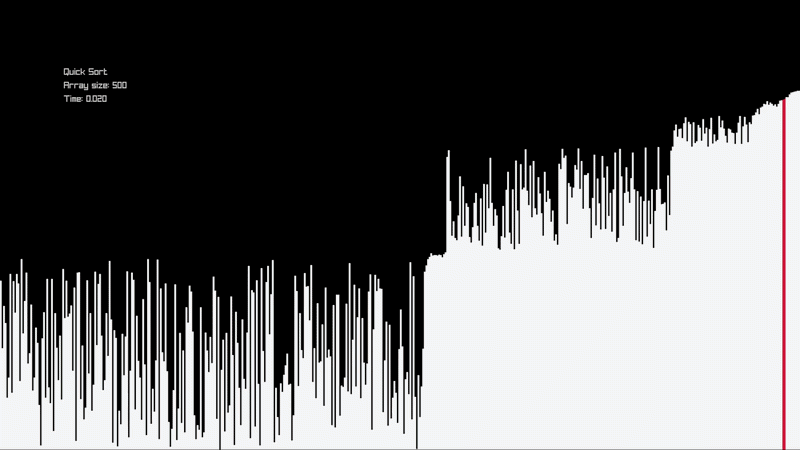
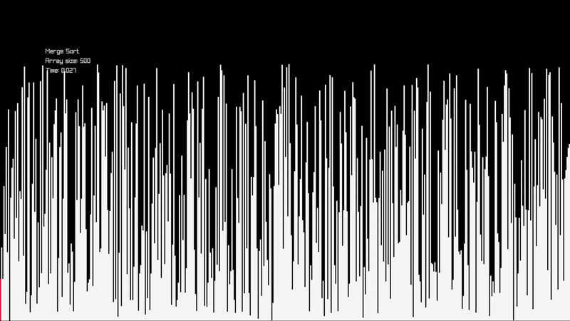

A sorting algorithms visualizer using raylib

### ** Disclaimer ** 

This is no "real time" sorting since the speed is bounded to the frames per second, but the time complexity difference between sorts remains

## Demos

### Bubble sort O(n²)

### Merge sort O(n log n)

### Quick sort O(n log n)
